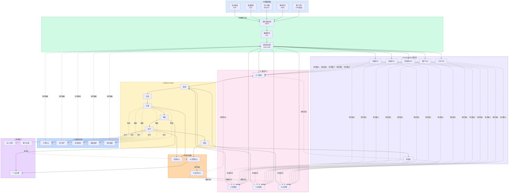
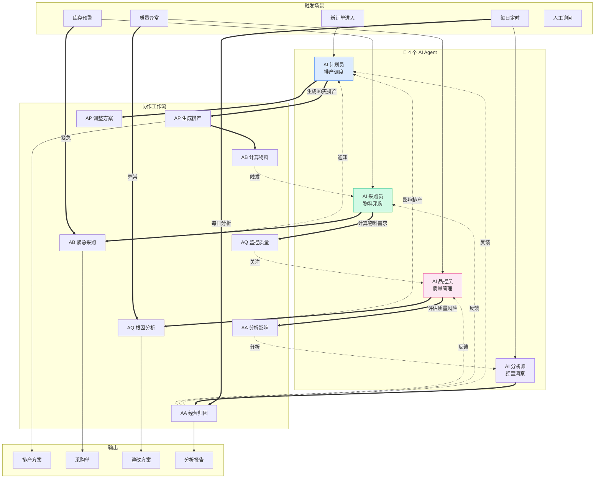
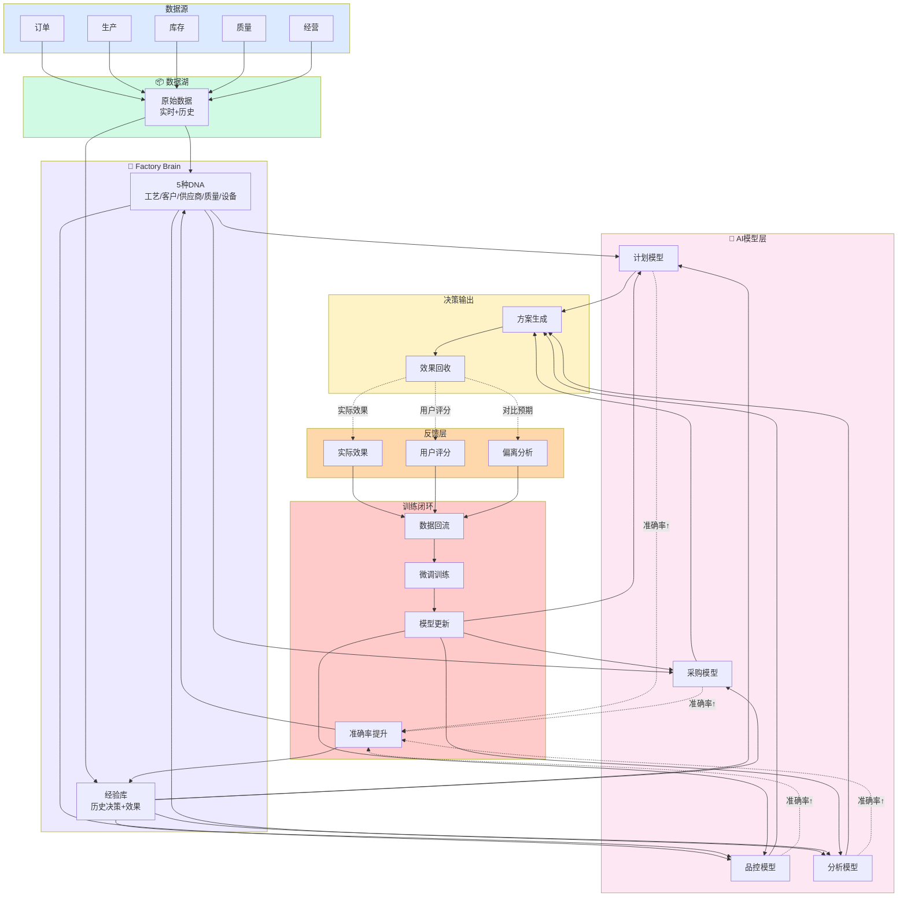
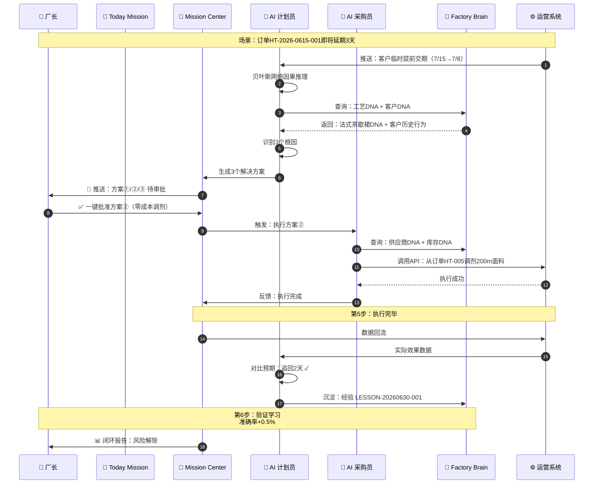

# 秩云 AI Factory OS V3.0 · 系统数据流程图

> 基于 AI-Native 设计范式的完整闭环数据流转 · 2026-06-30

## 📊 系统概览

| 层级 | 数量 | 说明 |
|------|------|------|
| 数据源 | 5 类 | 客户订单/物料库存/生产设备/质量检测/财务报表 |
| AI Agent | 4 个 | 计划员/采购员/品控员/分析师 |
| 闭环流程 | 6 步 | 发现→分析→方案→审批→执行→验证 |
| Factory Brain | 5 种 DNA | 工艺/客户/供应商/质量/设备 |
| Mission Center | 3 状态 | 待确认/执行中/已完成 |

---

## 📐 流程图 1 · 核心架构与数据流转总览

---

## 🔄 流程图 2 · AI 任务闭环 6 步流转（核心）

```mermaid
flowchart LR
    subgraph Step1["① 发现 Discover"]
        S1[数据异常<br/>触发条件]
        S1a[库存预警<br/>ALT-002]
        S1b[交期预警<br/>ALT-001]
        S1c[质量异常<br/>ALT-003]
        S1 --> S1a & S1b & S1c
    end

    subgraph Step2["② 分析 Analyze"]
        S2[贝叶斯网络<br/>因果推理]
        S2a[识别根因链]
        S2b[追溯影响范围]
        S2c[计算风险等级]
        S2 --> S2a --> S2b --> S2c
    end

    subgraph Step3["③ 方案 Solution"]
        S3[强化学习<br/>生成方案]
        S3a[多方案对比]
        S3b[成本效益评估]
        S3c[推荐最优解]
        S3 --> S3a --> S3b --> S3c
    end

    subgraph Step4["④ 审批 Approval"]
        S4[智能路由<br/>权限匹配]
        S4a[小金额<br/>自动执行]
        S4b[大金额<br/>人工审批]
        S4c[紧急<br/>厂长直达]
        S4 --> S4a & S4b & S4c
    end

    subgraph Step5["⑤ 执行 Execute"]
        S5[API直连<br/>业务系统]
        S5a[触发采购]
        S5b[调整排产]
        S5c[派发工单]
        S5 --> S5a & S5b & S5c
    end

    subgraph Step6["⑥ 验证 Verify"]
        S6[效果归因<br/>数据回收]
        S6a[实际结果]
        S6b[vs 预期]
        S6c[经验沉淀]
        S6 --> S6a --> S6b --> S6c
    end

    S1c ==>|"数据异常"| S2
    S2c ==>|"根因确定"| S3
    S3c ==>|"最优方案"| S4
    S4b ==>|"人工批准"| S5
    S5c ==>|"执行完成"| S6
    S6c ==>|"进入知识库"| FB[Factory Brain<br/>经验库]

    style Step1 fill:#fef3c7,stroke:#f59e0b
    style Step2 fill:#fed7aa,stroke:#f97316
    style Step3 fill:#fecaca,stroke:#ef4444
    style Step4 fill:#fce7f3,stroke:#ec4899
    style Step5 fill:#ddd6fe,stroke:#8b5cf6
    style Step6 fill:#d1fae5,stroke:#10b981
```

---

## 🤖 流程图 3 · 4 个 AI Agent 协作网络

---

## 🔁 流程图 4 · 数据闭环回流（自学习系统）

---

## 📋 流程图 5 · 典型业务场景：订单延期风险处理

---

## 📊 关键数据流转说明表

| 序号 | 流程步骤 | 输入数据 | 处理逻辑 | 输出数据 | 耗时 | 负责 Agent |
|------|----------|----------|----------|----------|------|-----------|
| 1 | 数据接入 | 订单/库存/设备/质量/财务 | Kafka 消息队列 + ETL清洗 | 规范化数据(Data Lake) | &lt; 1s | 系统自动 |
| 2 | 异常发现 | 实时业务数据流 | 阈值检测 + 模式识别 | 预警事件 (ALT-XXX) | &lt; 3s | 4 Agent 并行 |
| 3 | 根因分析 | 预警事件 + 历史数据 | 贝叶斯网络因果推理 | 根因链 + 影响范围 | ~ 5s | 对应 Agent |
| 4 | 方案生成 | 根因 + DNA 知识库 | 强化学习 + 多目标优化 | 候选方案 + 推荐评分 | ~ 10s | 对应 Agent |
| 5 | 人工审批 | 推荐方案 | 权限匹配 + 风险评估 | 批准/修改/驳回 | 人工 | 厂长/管理员 |
| 6 | 自动执行 | 批准方案 | API 直连 ERP/生产/采购 | 业务执行结果 | ~ 30s | 对应 Agent |
| 7 | 效果验证 | 执行结果 + 预期目标 | 归因分析 + 偏离评估 | 实际效果 + 评分 | ~ 1h | 对应 Agent |
| 8 | 经验沉淀 | 决策 + 效果数据 | 知识蒸馏 + 模型微调 | Factory Brain 更新 | 每周 | AI 进化中心 |

---

## ✨ AI-Native 核心特征总结

| 特征 | AI-Native（本系统） | 传统 ERP |
|------|---------------------|----------|
| 🎯 入口 | 目标驱动（Today Mission） | 功能菜单（订单/库存/生产） |
| 🤖 角色 | Agent-First，AI 是主要用户 | 工具辅助，人是操作者 |
| 🔄 流程 | 完整闭环（6步可追溯） | 单向流程（操作→记录） |
| 📊 学习 | 自学习（每周 +1~3% 准确率） | 静态规则（人工维护） |
| 🧠 知识 | Factory Brain 五大DNA | 数据库 + 文档 |
| ⚡ 响应 | 实时（&lt; 5s 发现） | 定期（日报/周报） |
| 👥 用户定位 | 监督者（Supervisor） | 操作者（Operator） |

---

> 💡 **可视化版本**：打开 `system_flow.html` 可在浏览器中获得带交互的彩色流程图。
> 📝 **本文件**：使用 GitHub Markdown + Mermaid 自动渲染，所有流程图原生支持。